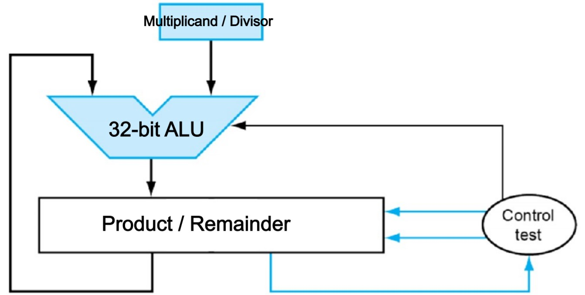
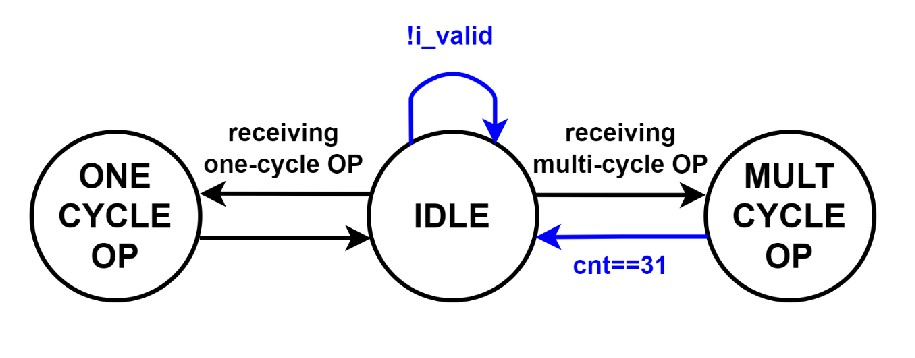

## HW2 Explanation

In this homework, we create an ALU supporting the following instructions:

1. Signed ADD, SUB, SLT

2. Unsigned AND, OR, SLL, MUL, DIV

MUL and DIV are done using 32 cycles, and the structure of the hardware for MUL and DIV is shown as the picture below: 

The finite state machine of this ALU is shown as the following picture: 

### How to run the files

To run these files, you need a VCS license. Alternatively, you can refer to [iverilog](https://bleyer.org/icarus/).

The following instructions are based on VCS: 

1. Inside /01_RTL

    `source 00_license.f`

2. Inside /01_RTL

    `source 01_run.f`