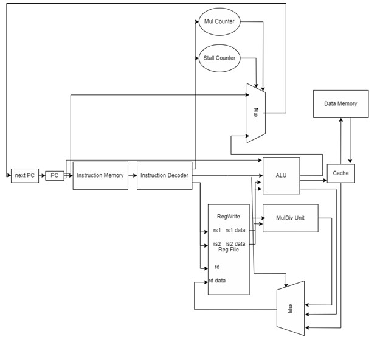
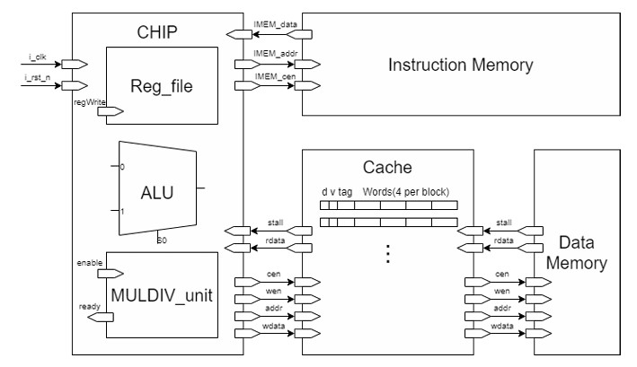

## Final Project Explanation

In this project, our team (2 people) implemented a single cycle CPU with a L1 cache. Among the joined 40 teams, we achieved the 2nd place in performance (total execution time).

### About the CPU

This CPU supports all basic RISC-V instructions on the Green Card. Contents regarding the MUL / DIV unit are the same as [HW2](https://github.com/andylcy2000/Computer-Architecture-Course/tree/main/HW2_verilog_ALU).

### About the Cache

Due to the nature of the simulated DRAM within this project, our cache isn't subject to physical constraints. Therefore, fully asscociated cache with write back is our best choice.

To accelerate overall performance, we only use 4 states within our cache, namely INITIAL, WRITE_BACK, ALLO, FINISH.

### Block Diagram of the CPU

### Block Diagram of the Overall Architecture

### Tasks

1. Basic add and subtraction

2. Factorial operations

3. Assembly code of [HW1](https://github.com/andylcy2000/Computer-Architecture-Course/tree/main/HW1_assembly_language)

4. Sorting numbers

### How to run the files

1. Inside /01_RTL

    `source 00_license.f`

2. Inside /01_RTL

    `source 01_run.f [I0/I1/I2/I3]`